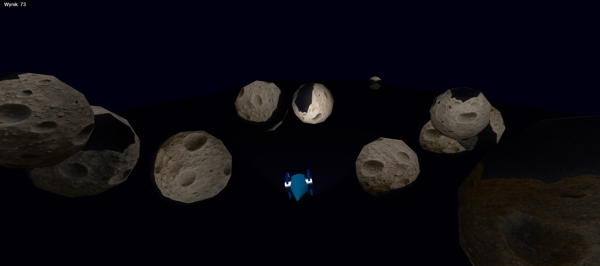
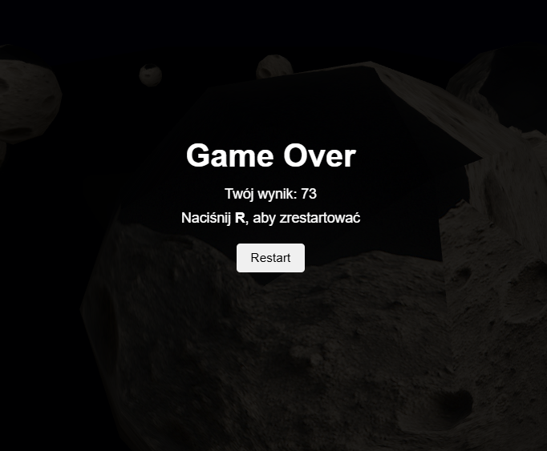

# Asteroids 3D - Three.js Game

**Autor:** Artur Saganowski

Prosta gra arcade 3D inspirowana klasykiem "Asteroids", stworzona przy użyciu biblioteki Three.js.

## Opis funkcjonalności

Gra polega na sterowaniu statkiem kosmicznym, który przemierza pole asteroid. Zadaniem gracza jest unikanie kolizji z nadlatującymi asteroidami tak długo, jak to możliwe.

### Główne funkcje:
- **Renderowanie 3D** - wykorzystanie WebGL przez Three.js dla płynnej grafiki 3D
- **Fizyka i kolizje** - detekcja kolizji między statkiem a asteroidami
- **System punktacji** - punkty za czas przetrwania (10 pkt/s)
- **Dynamiczna kamera** - kamera podąża za statkiem z gładkim przejściem
- **Oświetlenie Phong** - pełny model oświetlenia (ambient + diffuse + specular)
  - AmbientLight - światło otoczenia
  - DirectionalLight - światło kierunkowe
  - SpotLight - latarka świecąca z przodu statku
- **Optymalizacje wydajnościowe**:
  - Wspólna geometria dla wszystkich asteroid
  - Reużywalne obiekty Vector3 (redukcja garbage collection)
  - Collision detection tylko dla bliskich obiektów
  - Aktualizacja DOM tylko przy zmianie wartości

### Mechanika gry:
- Statek porusza się automatycznie do przodu
- Gracz może sterować statkiem w lewo/prawo
- Asteroidy pojawiają się losowo przed statkiem
- Gra kończy się po kolizji asteroidy ze statkiem
- Możliwość restartu po zakończeniu gry

## Instrukcja uruchomienia

### Metoda 1: Live Server (zalecana)

1. Zainstaluj rozszerzenie **Live Server** w VS Code
2. Otwórz folder projektu w VS Code
3. Kliknij prawym przyciskiem na `index.html`
4. Wybierz "Open with Live Server"
5. Gra otworzy się w przeglądarce

### Metoda 2: Python HTTP Server

```bash
# Python 3
python -m http.server 8000

# Następnie otwórz przeglądarkę i wejdź na:
# http://localhost:8000
```

### Wymagania:
- Nowoczesna przeglądarka z obsługą WebGL (Chrome, Firefox, Edge, Safari)
- Połączenie internetowe (dla załadowania Three.js z CDN)

## Sterowanie

| Klawisz | Akcja |
|---------|-------|
| **←** | Ruch w lewo |
| **→** | Ruch w prawo |
| **R** | Restart gry (po kolizji) |

## Zrzuty ekranu

### Widok rozgrywki

*Statek unikający nadlatujących asteroid, widoczne zastosowanie modelu oświetlenia Phonga*

### Ekran Game Over

*Ekran końcowy z wynikiem gracza*

## Użyte biblioteki

### Three.js v0.160.0
- **Źródło**: https://unpkg.com/three@0.160.0/build/three.module.js
- **Licencja**: MIT
- **Opis**: Biblioteka JavaScript do tworzenia grafiki 3D w przeglądarce przy użyciu WebGL
- **Wykorzystane moduły**:
  - `THREE.Scene` - scena 3D
  - `THREE.PerspectiveCamera` - kamera perspektywiczna
  - `THREE.WebGLRenderer` - renderer WebGL
  - `THREE.MeshPhongMaterial` - materiał z cieniowaniem Phonga
  - `THREE.AmbientLight`, `THREE.DirectionalLight`, `THREE.SpotLight` - oświetlenie
  - `THREE.IcosahedronGeometry` - geometria dla asteroid
  - `THREE.ConeGeometry`, `THREE.CylinderGeometry`, `THREE.BoxGeometry` - geometria statku

## Assety

### Tekstury
- **assets/asteroid_texture.png** - tekstura dla asteroid

### Modele 3D (proceduralne)
Wszystkie modele są tworzone proceduralnie w kodzie:
- **Statek** - składa się z:
  - Stożka (nos) - `ConeGeometry`
  - Cylindra (korpus) - `CylinderGeometry`
  - Dwóch skrzydeł - `BoxGeometry`
- **Asteroidy** - `IcosahedronGeometry` z losową skalą

## Licencja

Projekt edukacyjny - wolny do użytku.
